# [Bootcamp Web Developer Full Stack](https://www.thebridge.tech/bootcamps/bootcamp-fullstack-developer/)

### HTML, CSS,  JS, ES6, Node.js, Frontend, Backend, Express, React, MERN, testing, DevOps

# Firebase


Firebase es un plataforma que ofrece servicios en la nube, adquirida por Google en 2014 y que proporciona herramientas para (entre otros): 

- BD NoSQL basada en colecciones como hemos visto con MongoDB
- Autenticación segura con diferentes plataformas (Google, Facebook, GitHub...)
- Almacenamiento en servidores para la información de las aplicaciones que desarrollemos

Todo esto sigue un modelo freemium y dispone de varias posibilidades (uso privado/público, con métricas...etc)

## Alta en la plataforma
Lo primero que tenemos que hacer es acceder a [Firebase](https://firebase.google.com/).

Si no hemos accedido nunca, nos pedirá un usuario/contraseña de Google.

## Crear un proyecto

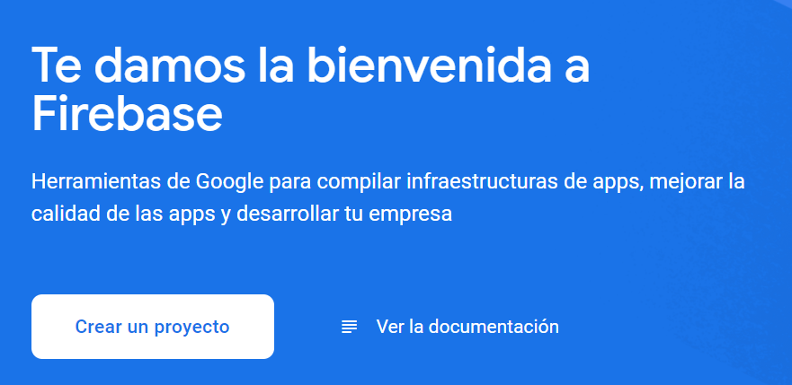

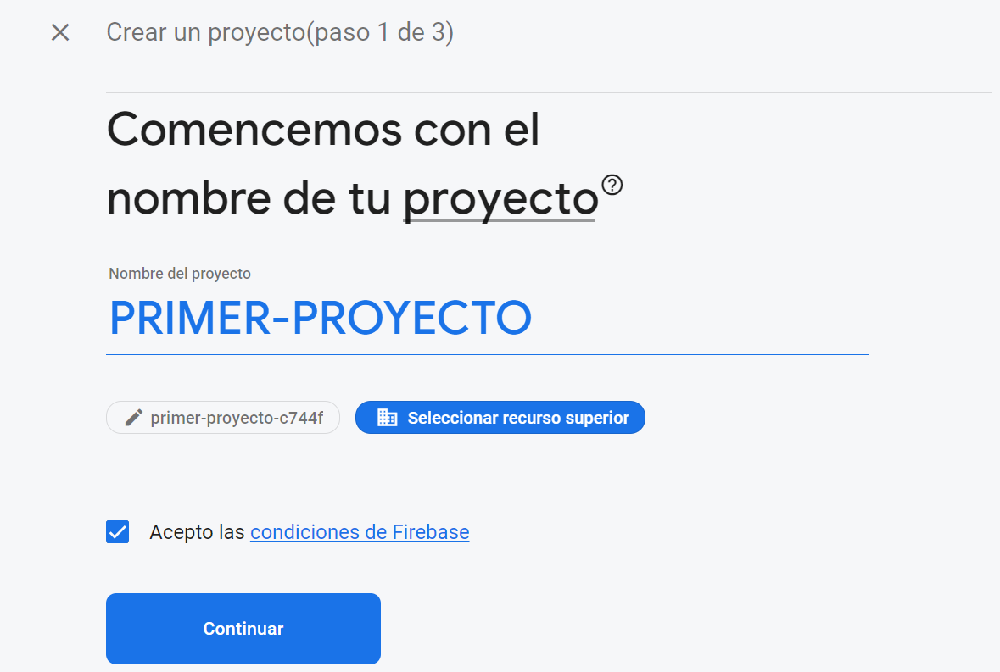

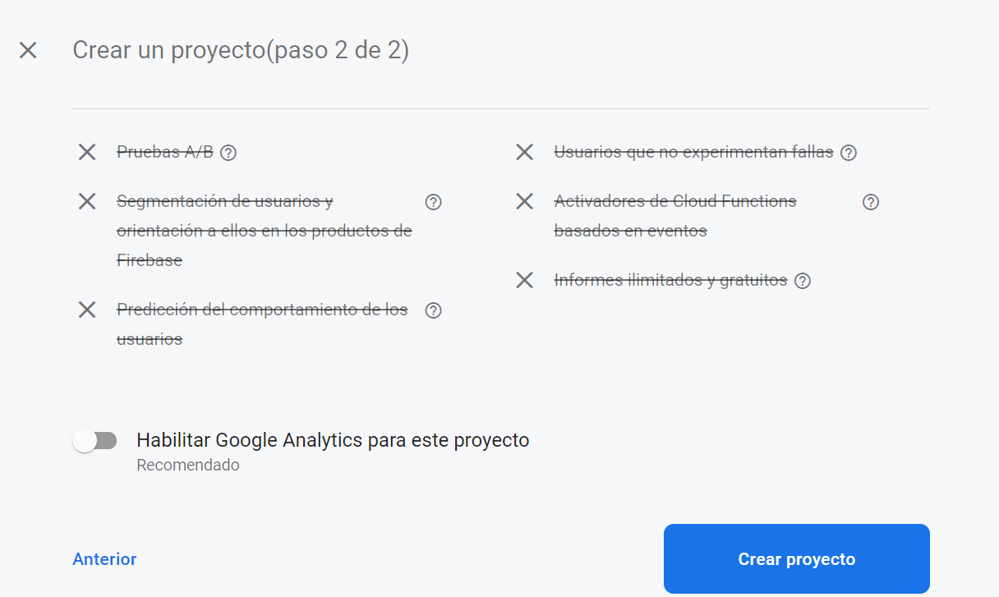

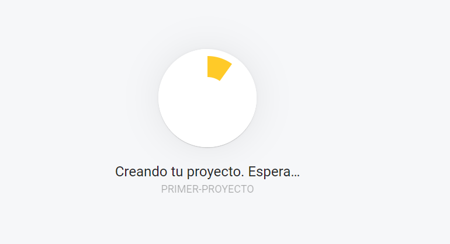

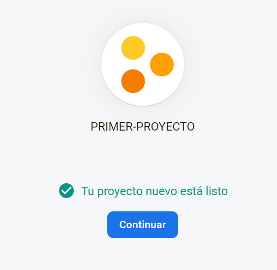


## Configuración inicial


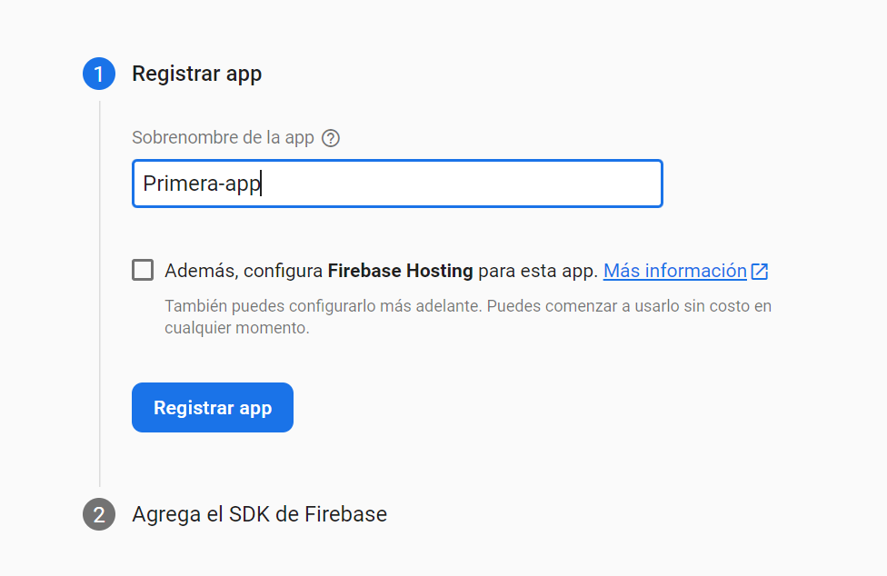

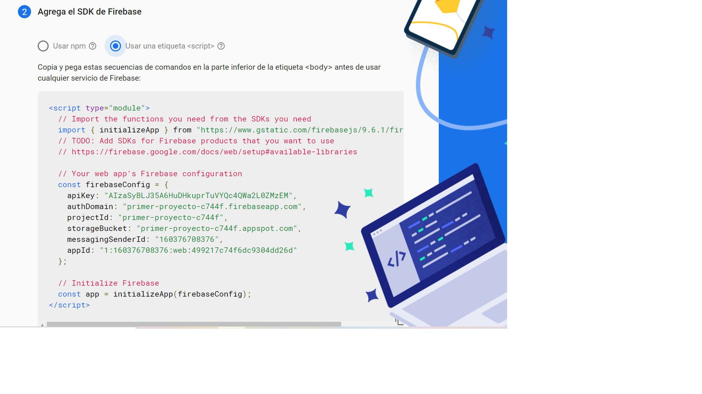


## Crear una BD

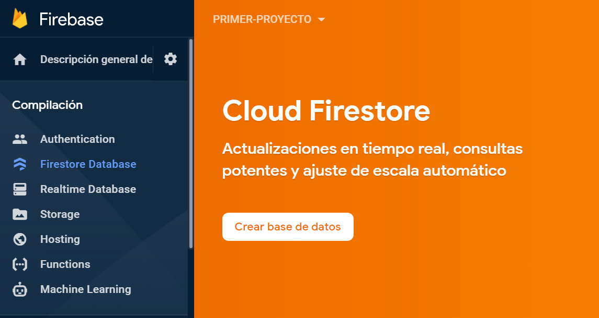

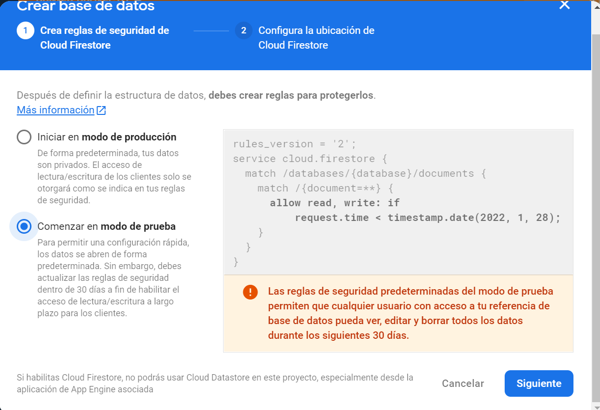

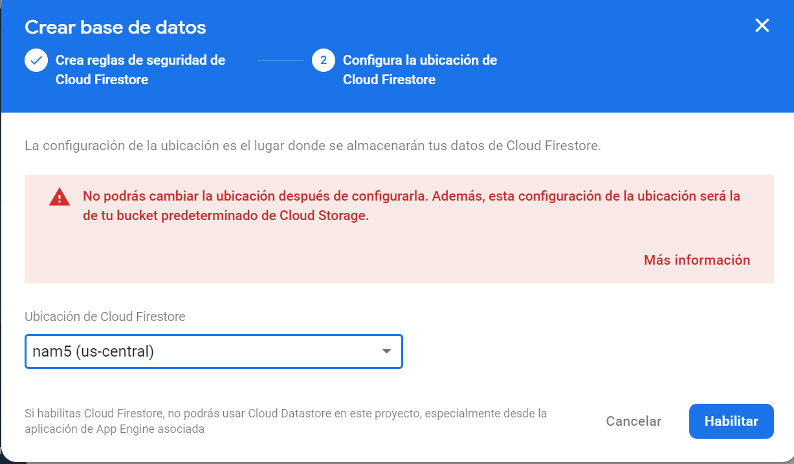

## Crear una colección

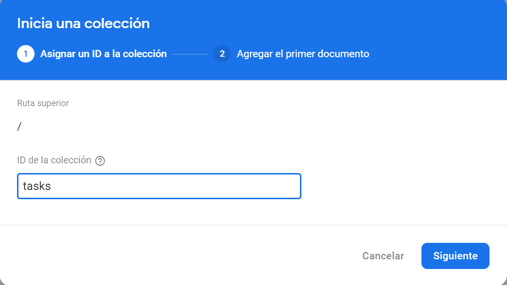

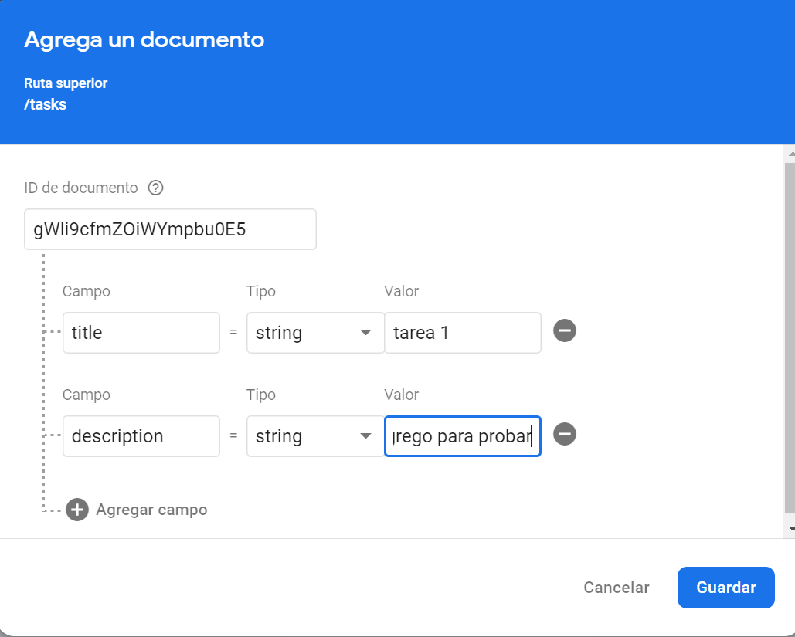

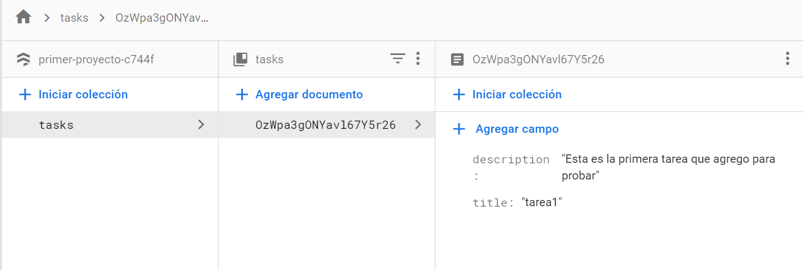

## Documentación 

[DOCUMENTACIÓN_FIREBASE](https://firebase.google.com/docs)


### Ejercicio

- A partir del siguiente JSON: 

```javascript 

 [
    {
      "nombre": "Francisco Ramirez",
      "edad": 29,
      "puesto": "Contable",
      "Emails": [
        "francisco@gmail.com",
        "francisco@hotmail.es",
        "francisco@thebridgeschool.es"
      ]
    },
    {
        "nombre": "Isabel Pérez",
        "edad": 31,
        "puesto": "Profesora",
        "Emails": [
          "isabel@gmail.com",
          "isabel@hotmail.es",
          "isabel@thebridgeschool.es"
        ]
      }
  ]

```

Crea una colección en Firestore de Firebase e inserta la información del mismo.

